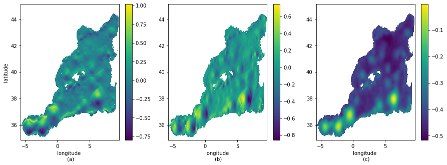
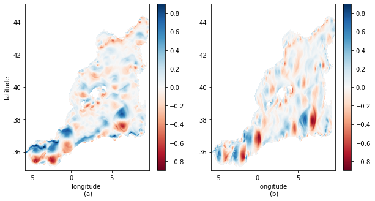
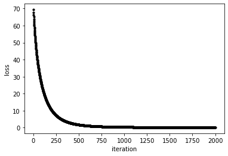
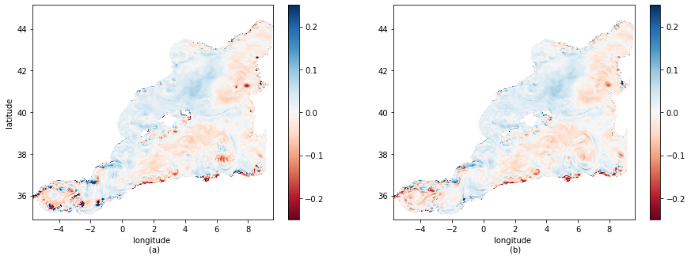
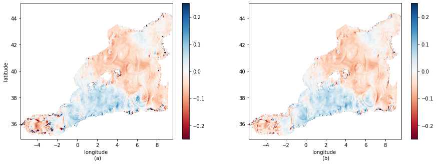

# Summary

In the field of oceanography, understanding the complex dynamics of ocean currents is crucial for accurate modeling and prediction of oceanic phenomena. The cyclogeostrophic balance, which relates the pressure gradient and the Coriolis force, plays a significant role in determining the behavior of oceanic circulation patterns. In this study, we present a novel approach based on a variational formulation to compute the inversion of the cyclogeostrophic balance.

The method leverages the power of JAX, a Python library for automatic differentiation, to efficiently solve the variational problem. By formulating the inversion as an optimization problem, we aim to determine the velocity field that respects the cyclogeostrophic balance.

We demonstrate the effectiveness of our method through a case study in a specific region: the Mediterranean Sea. By utilizing observational data from satellite altimetry, we showcase the ability of our approach and the code developed to solve the problem. We quantify the performance of the inversion by comparing the derived velocities with data provided by the eNATL60 configuration of the NEMO ocean circulation [@nemo:2022], validating the reliability and accuracy of our method.

The results obtained from this study provide valuable insights into the oceanic circulation dynamics and offer a promising avenue for further advancements in oceanographic research. The variational formulation, coupled with the computational efficiency of JAX, presents a powerful tool for studying and understanding the cyclogeostrophic balance in the context of oceanography. Our findings contribute to the ongoing efforts to improve oceanic circulation modeling and advance our understanding of the complex processes governing the world's oceans.

# Statement of need

Understanding the dynamics of oceanic circulation is crucial for a wide range of applications in oceanography. One effective way to estimate the ocean surface is through altimetry, which involves using satellite measurements to determine the height of the ocean surface. Altimetry data provides information on the topography of the ocean surface, as well as on variations in sea level.

To analyze and interpret altimetry data, the formulation known as geostrophy is used. Geostrophy is a fundamental concept in fluid dynamics, as it describes the balance between the pressure gradient force and the Coriolis force, which arises from the rotation of the Earth. This balance can be derived from the primitive equations of Navier-Stokes, which leads to a velocity field in the ocean known as geostrophic velocities, used to estimate ocean currents (\autoref{eq:geostrophic_balance}).

\begin{equation}
    \label{eq:geostrophic_balance}
    f\left(\vec{k} \times \vec{u_g}\right) = -g \nabla \eta,
\end{equation}

where:

* f: Coriolis parameter;
* $\vec{k}$: vertical unit vector;
* $\vec{u_g}$: geostrophic velocity;
* g: gravity;
* $\eta$: sea surface height.

However, as discussed by `@Cao:2023` geostrophy alone is not always sufficient to accurately estimate the ocean surface; it has been shown that the geostrophic velocity can produce errors in the order of 30 % [`@Penven:2014`], disclosing the limitation of this approximation. To account for that limitation, more complex models that incorporate additional factors were developed, such as the cyclogeostrophy.

\autoref{eq:geostrophic_balance} does not consider the centrifugal acceleration and the inertial effects of oceanic dynamics, and therefore, if one is to consider these effects, a correction to the equation must be made. Thus, a more robust mathematical model has to be introduced by considering the advective term ($\vec{u} \cdot \nabla \vec{u}$) in \autoref{eq:geostrophic_balance}.

Considering a horizontal, stationary, and inviscid flow, the momentum equation linking the horizontal surface flow ($\vec{u}$) with SSH can be expressed as:

\begin{equation}
    \label{eq:cyclogeostrophic_balance}
    \vec{u} \cdot \nabla \vec{u} + f\left(\vec{k} \times \vec{u}\right) = -g \nabla \eta
\end{equation}

By introducing the geostrophic velocity ($\vec{u_g}$) from \autoref{eq:geostrophic_balance}, into \autoref{eq:cyclogeostrophic_balance}, the expression can be written in the following form:

\begin{equation}
    \label{eq:cyclogeostrophic_balance_ug}
    \vec{u_c} - \frac{\vec{k}}{f} \times \left(\vec{u_c} \cdot \nabla \vec{u_c}\right) = \vec{u_g},
\end{equation}

where:

* $\vec{u_c}$: cyclogeostrophic velocity.

As \autoref{eq:cyclogeostrophic_balance_ug} is nonlinear due to the advective term, solving the cyclogeostrophic equations is a computationally demanding and challenging task. Besides, the nonlinearity means that an exact analytical solution is often not possible, and even with numerical solutions, the results might diverge. Therefore, the inversion process requires efficient algorithms and numerical techniques to handle large datasets.

The current state-of-the-art method to solve the cyclogeostrophic equations is known as the iterative formulation, introduced by `@Arnason:1962` and `@Endlich:1961` which consists of solving the equations in an iterative manner until convergence is achieved.

The iterative scheme used to estimate the cyclogeostrophic approximation is given by:

\begin{equation}
    \label{eq:iterative_method}
    \vec{u^{n+1}} = \vec{u_g} + \frac{\Vec{k}}{f} \times \left( \vec{u^n} \cdot \nabla \vec{u^n} \right).
\end{equation}

The equation stated above was used by `@Penven:2014` to study oceanic eddies in the Mozambique channel, and it is also known to diverge. Consequently, a scalar residual function was defined as $res = \left\lVert \vec{u_{n+1}} - \vec{u_n} \right\rVert^2$ to control the iteration process; more precisely, the iteration stops when the residual variable is below 0.01 m/s or it starts to increase.

Hence, this paper describes a software that implements a new approach to solve the cyclogeostrophic inversion problem based on the minimization of a variational formulation, which can be written as:

\begin{equation}
    \label{eq:loss_function}
    J = \int_{\Omega} \left\lVert \vec{u} - \frac{\vec{k}}{f} \times \left(\vec{u} \cdot \nabla \vec{u}\right) - \vec{u_g} \right\rVert^2 d \Omega,
\end{equation}

where:

- J: variational formulation chosen for the problem;
- $\Omega$: volume control.

For a discrete medium and a two-dimensional velocity field, \autoref{loss_function} can be expanded as:

\begin{equation}
    \label{eq:loss_function_expanded}
    J = \int_{S} \left( u + \displaystyle \frac{1}{f} \left(\vec{u} \cdot \nabla v \right) - u_g \right)^2 + \left(v - \displaystyle \frac{1}{f} \left(\vec{u} \cdot \nabla u \right) - v_g \right)^2 dS
\end{equation}

The cyclogeostrophic currents are obtained by minimizing the variational formulation with a gradient descent method (\autoref{eq:Gradient_descent}). The software is written in Python and uses the JAX library, developed by Google for high-performance numerical computing and machine learning, to avoid the hand coding of the variational formulation's gradient and improve computational performance.

\begin{equation}
    \label{eq:Gradient_descent}
    \theta = \theta - \alpha . \nabla J(\theta),
\end{equation}

where:

* $\theta$: parameter vector being optimized;
* $\alpha$: learning rate, which determines how big the steps taken in each iteration are;
* $\nabla J(\theta)$: gradient of the function being minimized with respect to $\theta$.

In the case of this study, the loss function $J$ will depend on two variables, u and v; therefore, \autoref{eq:Gradient_descent} is expressed as:

\begin{equation}
    \label{Gradient_descent_cyclo}
    \begin{cases}
        u = u - \alpha . \nabla_x J(u,v),\\
        v = v - \alpha . \nabla_y J(u,v)
    \end{cases}
\end{equation}

# Exemple of use

In this section, we will demonstrate an example of using the software with data from the eNATL60 configuration of the NEMO ocean circulation model, specifically in the Mediterranean Sea. The data used in this example is available in the [cyclogeostrophic balance repository](https://github.com/VictorZaia/cyclogeostrophic_balance).

Before presenting the results themselves, the data to be treated will be presented. Figure 1 shows the simulation of the zonal and meridional velocity components, which will be used for comparison with the software, and the measurement of the sea surface height (SSH) needed to compute the geostrophic velocity.

\autoref{fig:cyclogeostrophic_balance_grad} presents the results found for the cyclogeostrophic velocities using the gradient descent-based approach.

As already stated, the cyclogeostrophic balance considers the nonlinear advective term in its equation. Therefore, it is of paramount importance to verify if the results that were found converged, namely, in this case, $J_T \to 0$. Figure 3 shows the number of iterations in relation to the total loss, yielding the conclusion that the algorithm converged.

\autoref{cyclogeostrophy_enatl_diff_methods_u} and \autoref{cyclogeostrophy_enatl_diff_methods_v} show a comparison between the results obtained using the iterative method and the gradient descent method with the data from eNATL60. The differences in zonal and meridional velocities are shown, demonstrating the improvement achieved with the new method.

# Conclusion

As displayed in the example of use section, the implementation of the cyclogeostrophic balance equation provides a more accurate estimation of ocean currents and their relation to sea level anomalies.

Overall, the tests indicated that the inversion code was accurate, efficient, and produced results that were consistent with expectations based on theoretical and observational knowledge of the ocean system. The implementation of the cyclogeostrophic balance enhanced the accuracy of the geostrophic equation and the estimation of ocean currents and their relation to the sea level. More importantly, the approach proposed was able to give more precise results when compared to the iterative method, commonly used in oceanographic studies.

# Acknowledgements

# References
