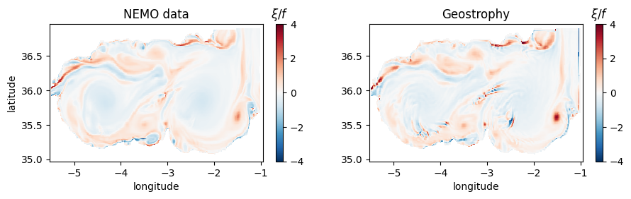
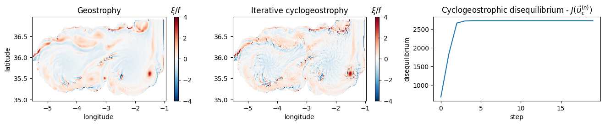

# Summary

Sea Surface Height (SSH) variations measured by satellite altimeters are widely used to estimate Sea Surface Currents (SSC) in oceanographic operational or research applications. The geostrophic balance approximation, which relates the pressure gradient, the current velocity, and the Coriolis force, is commonly employed to estimate SSC from SSH. It is known that under some configurations, the centrifugial acceleration, disregarded in the geostrophic formulation, should be included to the balance, leading to the cyclogeostrophic balance approximation. In general, solving the cyclogeostrophic balance can not be done analytically and numerical methods are needed. However, (1) existing iterative approaches are known to diverge, and ad-hoc methods should be used to avoid local discontinuities; (2) well documented, and publicly available implementations are missing.

To overcome these limitations, we propose the Python package `jaxparrow`.`jaxparrow` formulates the cyclogeostrophic balance as a variational problem and solve it using a collection of well known optimizers. Its implementation heavily relies on JAX, the Python library bringing together automatic differentation and just-in-time compilation, and the growing ecosystem around it. `jaxparrow` can be used as a package for an easy integration to existing oceanographic pipelines, or as a standalone executable working directly with NetCDF files.

# Statement of need

Sea Surface Currents (SSC) can be easily approximated from satellite altimetry observations of the Sea Surface Height (SSH) using the geostrophic balance. Geostrophy describes the balance between the pressure gradient force (indirectly observed via the SSH), and the Coriolis force. Geostrophic currents satisfy this equilibrium:

\begin{equation}\label{eq:geostrophic_balance}
f \left(\vec{k} \times \vec{u}_g \right) = -g \nabla \eta,
\end{equation}

where $f$ is the Coriolis parameter, $\vec{k}$ the vertical unit vector, $\vec{u}_g$ the geostrophic velocity, $g$ the gravity, and $\eta$ the Sea Surface Height.

However, as discussed by @charney1955gulf, @bakun2006fronts, and @maximenko2006mean, geostrophy alone is not always sufficient to accurately estimate the SSC, and an advective term should be considered. For example, it has been shown by @penven2014cyclogeostrophic that, in the highly energetic Mozambique Channel, the geostrophic velocity can produce errors in the order of 30%. In these conditions, the centrifugal acceleration and the inertial effects of oceanic dynamics are no longer neglectable. To account for those forces, the advective term $\vec{u} \cdot \nabla \vec{u}$ is added back to the balance. Considering a horizontal, stationary, and inviscid flow, the momentum equation linking the currents velocity $\vec{u}$ with the SSH —through the geostrophic velocity $\vec{u}_g$ from \autoref{eq:geostrophic_balance}— can be expressed as:

\begin{equation}\label{eq:cyclogeostrophic_balance}
\vec{u}_c - \frac{\vec{k}}{f} \times \left(\vec{u}_c \cdot \nabla \vec{u}_c \right) = \vec{u}_g, 
\end{equation}

where $\vec{u}_c$ is the cyclogeostrophic velocity.

Ocean data and services providers, such as Copernicus Marine Environment Monitoring Service, rely on the geostrophic balance. @cao2023global demonstrates that applying cyclogeostrophic corrections to the global ocean over a 25-years period results in significantly different ocean dynamics. As such, ocean products could greatly benefit from a robust and open estimation method of cyclogeostrophic currents.

# Numerical resolution of the cyclogeostrophic inverse problem

Because of the advective term $\vec{u}_c \cdot \nabla \vec{u}_c$, \autoref{eq:cyclogeostrophic_balance} is nonlinear, and solving it analytically is conceivable only in idealized scenarios, making numerical approaches essential. The current state-of-the-art method to solve the cyclogeostrophic equation is the iterative formulation introduced by @arnason1962higher and @endlich1961computation, which consists of reaching balance using the following iterative scheme:

\begin{equation}\label{eq:iterative_method}
\vec{u}_c^{(n+1)} = \vec{u}_g + \frac{\vec{k}}{f} \times \left( \vec{u}_c^{(n)} \cdot \nabla \vec{u}_c^{(n)} \right),
\end{equation}

with $\vec{u}_c^{(0)} = \vec{u}_g$. This approach is known to diverge since @arnason1962higher, and in practice [@penven2014cyclogeostrophic; @ioannou2019cyclostrophic] the residual $res = \vert \vec{u}_c^{(n+1)} - \vec{u}_c^{(n)} \vert$ is used to control point by point the iteration process. The iteration locally stops when the point residual is below 0.01 m/s or starts to increase.

To avoid the local divergence issue of the iterative process, and its ad-hoc control, we propose to formulate the cyclogeostrophy as the variational problem:

\begin{equation}\label{eq:var_functional}
J(\vec{u}_c) = \left\lVert \vec{u_c} - \frac{\vec{k}}{f} \times \left(\vec{u_c} \cdot \nabla \vec{u_c}\right) - \vec{u_g} \right\rVert^2,
\end{equation}

where $\lVert.\rVert$ is the discrete $L^2$ norm. Thanks to JAX [@bradbury2021jax] automatic differentiation capabilities, $\nabla J$ is numerically available, and the cyclogeostrophic currents are estimated by minimizing \autoref{eq:var_functional} using a gradient-based optimizer, with $\vec{u}_c^{(0)} = \vec{u}_g$ as initial guess.

# Application to the Alboran sea

The Alboran sea is an energetic area of the Mediterannean sea. We demonstrate below the need to consider cyclogeostrophy in this region, and in particular the benefit of the variational formulation implemented in `jaxparrow`. The data and results presented here can be found in the [Alboran sea notebook](https://github.com/meom-group/jaxparrow/blob/main/notebooks/alboran_sea.ipynb) hosted on GitHub.

We use SSH and SSC from the eNATL60 configuration [@brodeau2020enatm60; @uchida2022cloud] of the state-of-the-art NEMO ocean circulation model [@nemo2022ocean] as reference data, and we computed the associated currents normalized vorticity (see \autoref{fig:ref}).

{width="100%"}

Using the SSH, `jaxparrow` can first estimate the geostrophic currents (\autoref{eq:geostrophic_balance}). As geostrophy is a major mechanism governing ocean dynamics, the vorticity derived from those currents present an overall similarity with the one obtain from NEMO data. However, we can clearly identify irregular areas (around (-4, 35.5), (-3, 36), and (-2.5, 35.5) in (longitude, latitude) coordinates, see \autoref{fig:geostrophy}) where the geostrophic balance fails to capture the true ocean circulation.

{width="66.7%"}

Starting from geostrophic currents, `jaxparrow` solves the variational formulation of the cyclogeostrophy (\autoref{eq:var_functional}), using in this example the classical gradient descent [@kantorovich2016functional]. As a result, almost all the problematic areas are now much more accurately reconstructed, leaving only costal or domain boundary regions with large differences from our reference vorticity (see \autoref{fig:variational}, left and middle panels). By evaluating the cyclogeostrophic disequilibrium (the functional $J$ from \autoref{eq:var_functional}) along the optimization process, we clearly see that `jaxparrow` is able to close the cyclogeostrophic balance (right panel of \autoref{fig:variational}).

{width="100%"}

In comparison, `jaxparrow` can also estimate the cyclogeostrophic currents using the iterative scheme (\autoref{eq:iterative_method}). In this example, it is evident that the point by point update of the velocities is not able to fill the cyclogeostrophic balance, and we notice that this estimation is qualitatively worse than the geostrophy (left and middle panels of \autoref{fig:iterative}). Even with an additional ad-hod threshold imposed on the residuals at the first iteration, divergence from cyclogeostrophic equilibrium immediately occurs (see \autoref{fig:iterative}, right panel).

{width="100%"}

Those qualitative observations are inline with the quantitative evaluation we performed. We computed the 1000 first percentiles of the vorticity distributions, and we observe, via a Q-Q plot [@wilk1968probability], that the percentiles of the variational distribution are the closest to the ones of the reference distribution (\autoref{fig:qqplot}).

{width="50%"}

# Availability

Beside the novel variational formulation, `jaxparrow` also offers the first to our knowledge open implementation of the cyclogeostrophy resolution. The code is available on [GitHub](https://github.com/meom-group/jaxparrow), with the specific tag `joss` for the version matching this publication; and the documentation, with pip-installation instuctions, usage examples, and toy notebooks, is hosted on [Read the Docs](https://jaxparrow.readthedocs.io).

# Acknowledgements

# References
